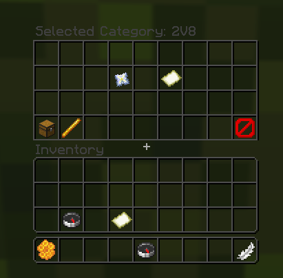
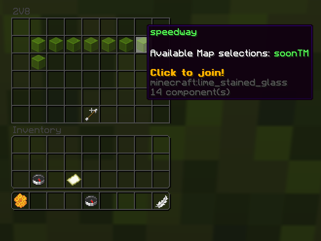

# BedWars2023-AdvancedGUI

**BW Advanced GUI** is an advanced graphical interface plugin designed **exclusively for BWProxy2023**.  
It adds a clean and intuitive GUI that allows players to navigate easily between **BedWars categories, maps, and arenas** across your network.

> ⚠️ **This plugin is NOT compatible with BedWars2023**.  
> It works **only with BWProxy2023**.

---

## ✨ Features

- 📂 Category-based navigation for BedWars arenas
- 🗺️ Easy map & arena browsing through a modern GUI
- 🌐 Fully designed for **proxy environments (BWProxy2023)**
- 🔌 **HotbarManager support** (by Kiiya)
- 🌍 Multi-language support
- ⚙️ Highly configurable GUI (items, slots, texts, permissions)

---

## 🔗 Compatibility

| Plugin                   | Supported                                                                         |
|--------------------------|-----------------------------------------------------------------------------------|
| BWProxy2023              | ✅ Yes REQUIRED!!!                                                                 |
| BedWars2023              | ❌ No (maybe in future)                                                            |
| HotbarManager (Kiiya)    | ✅ Optional integration                                                            |
| Lobby Editor (ItzSuolis) | ~ Not supported currently but planning to do it  (I don't have the plugin so) |
| PlaceholderAPI           | ✅ Yes (inside the language(s) file)                                               |

---

## 📖 Documentation (Wiki)

All configuration options, permissions, and advanced usage are documented in the **GitHub Wiki**:

➡️ **Wiki:**  
https://github.com/OXipro/BedWars2023-AdvancedGUI/wiki

*(Setup, configuration, placeholders, HotbarManager integration, etc.)*

---

## 🛠️ Installation

1. Download the plugin `.jar` (in the GitHub releases)
2. Place it in your **server plugins folder**
3. Make sure **BWProxy2023** is installed and running
4. Restart the server
5. Configure the plugin via the config/languages files

---

## 📸 Screenshots

> Some previews of the GUI in action:

<!-- Replace with your real images -->

---

## 👨‍💻 Developer

- **Author:** OXipro
- **Discord:** `oxipro`
- **Developer Discord:**  
  👉 https://discord.gg/Bvnzz2n9fp

Feel free to join the Discord for:
- Support
- Bug reports
- Suggestions
- Development updates

---

## 📄 License

[GPLv3](LICENSE)

---

## Credits

- Kiiya (HotbarManager) helped my a lot through the dev of the plugin
- OXipro (main dev)